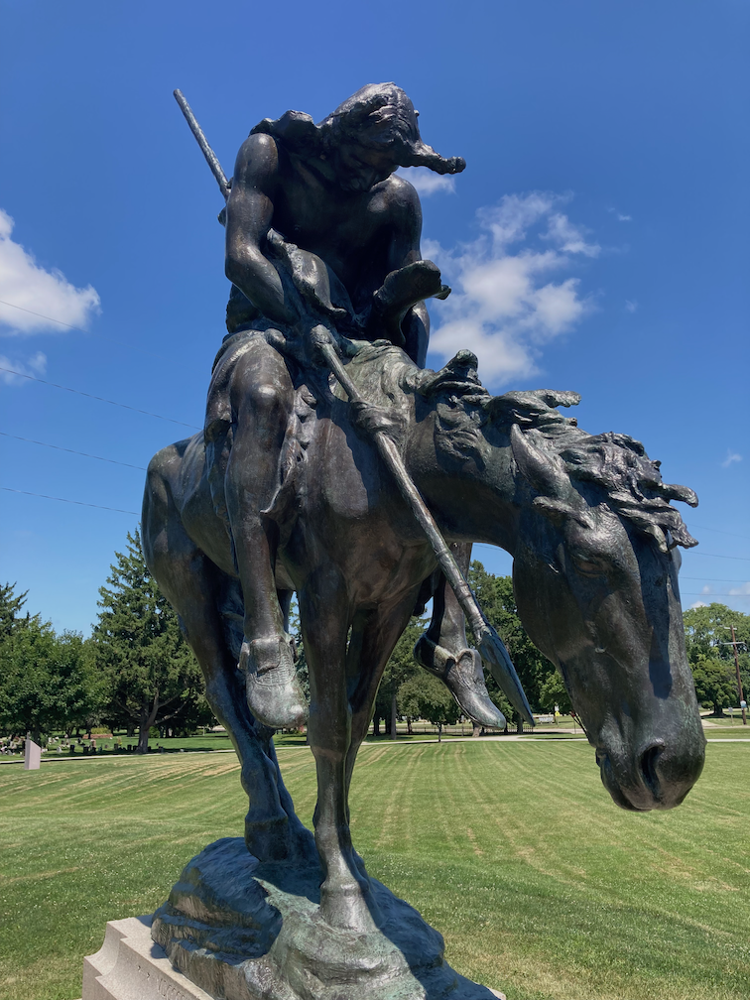

---
source:
tags:
alias:
date: 2025-07-28
modified: 2025-07-28T08:14:48-04:00
title: Dr. Kenton Wakes Up - Jul 28, 2025
layout: post
comments: true
---

  

<iframe width="560" height="315" src="https://www.youtube.com/embed/JP_VHLtZNiQ" title="YouTube video player" frameborder="0" allow="accelerometer; autoplay; clipboard-write; encrypted-media; gyroscope; picture-in-picture; web-share" allowfullscreen></iframe>

---

My parents are very spry and love to go on adventures. This time, they stopped in a town called Waupon, WI to get some ice cream. They also took some very nice pictures of the statue called "End of the Trail" sculpted by James Earle Fraser.

---

 

This is the landmark registry sign, telling a bit about the installation and where it came from and who paid for it, etc.

 

  

---

